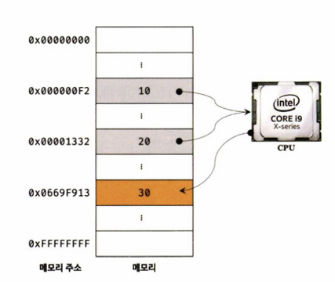

## 변수

### 변수랑 무엇인가? 왜 필요한가?

- 컴퓨터는 연산과 기억을 수행하는 부품이 나눠져 있다. 컴퓨터는 cpu를 사용해 연산하고, 메모리를 사용해 데이터를 기억한다.
- 각 셀은 고유의 메모리 주소를 갖는다. 이 메모리 주소는 메모리 공간의 위치를 나타내며, 0부터 시작해서 메모리의 크기만큼 정수로 표현된다.
- 연산 결과를 단 한 번만 사용한다몀 문제가 없겠지만 만약 연산 결과 30을 제사용하고 싶다면 메모리 주소를 통해 연산 결과 30이 저장된 메모리 공간에 직접 접근하는 것 이외에는 방법이 없다.
- 변수는 하나의 값을 저장하기 위해 확보한 메모리 공간 자체 또는 그 메모리 공간을 식별하기 위해 붙인 이름을 말한다.
  
- 변수에 값을 저장하는 것을 할당이라 하고, 변수에 저장된 값을 읽어 들이는 것을 참조라 한다.

### 식별자

- 변수 이름을 식별자라고도 한다. 식별자는 어떤 값을 구별해서 식별할 수 있는 고유한 이름을 말한다.
- 식별자는 값이 아니라 메모리 주소를 기억하고 있다.

### 변수 선언

- 변수 선언이란 값을 저장하기 위한 ㅔㅁ모리 공간을 확보하고 변수 이름과 확보된 메모리 공간의 주소를 연결해서 값을 저장할 수 있게 준비하는 것이다.
- 변수를 사용할 때는 var, let, const를 사용한다.
- var로 선언해 확보된 메모리 공간에는 자바스크립트 엔진의 의해 undefined라는 값이 암묵적으로 할당되어 초기화된다.

### 깂의 할당

- 변수 선언은 소스코드가 순차적으로 실행되는 시점인 런타임 이전에 먼저 실행되지만 값의 할당은 소스코드가 순차적으로 실행되는 ㅅ히점인 런타임에 실행된다.

### 값의 재할당

- 재할당은 현재 변수에 저장된 값을 버리고 새로운 값을 저장하는 것이다.
- 만약 값을 재할당할 수 없어서 변수에 저장된 값을 변경할 수 없다면 변수가 아니라 상수라 한다.

### 질문 및 정리

<strong>변수에 값을 할당하고 동일한 값을 할당한 경우 메모리 주소를 바뀌는가?</strong>

> 자바스크립트에서 같은 값을 다시 할당할 때 메모리 주소는 엔진 구현에 따라 바뀔 수도 있고 유지될 수도 있습니다.

---

<strong>호이스팅이란?</strong>

> 호이스팅은 변수 선언과 함수 선언이 코드 실행 전에 해당 스코프의 최상단에 선언된 것처럼 동작하는 자바스크립트의 특성입니다. 실제로 코드가 이동하는 것은 아니며, 엔진이 실행 전 선언 정보를 먼저 메모리에 등록하기 때문에 발생합니다. var는 undefined로 초기화되고, let과 const는 TDZ로 인해 초기화 전 접근 시 에러가 발생합니다.자바스크립트 엔진은 실행 전 함수 선언문 자체를 생성 단계에서 메모리에 등록합니다.그래서 바로 호출 가능합니다.

---

<strong>가비지 컬렉션은 무엇인가요?</strong>

> 가비지 컬렉션(Garbage Collection)은 프로그램에서 더 이상 사용되지 않는 메모리를 자동으로 찾아 해제하는 기능입니다. 자바스크립트 엔진은 어떤 값이 변수나 객체에서 더 이상 참조되지 않으면 필요 없는 데이터로 판단하고, 해당 메모리를 회수하여 다시 사용할 수 있게 만듭니다. 이를 통해 개발자가 직접 메모리를 관리하지 않아도 되고, 메모리 누수를 줄이는 데 도움을 줍니다.

